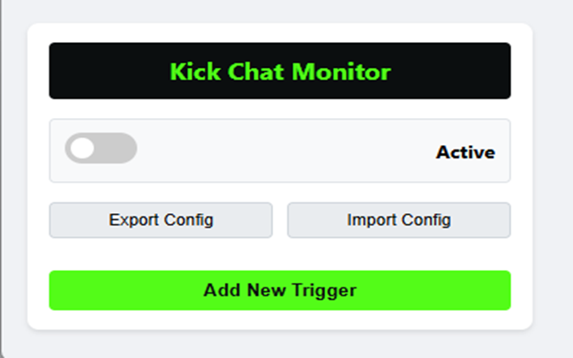
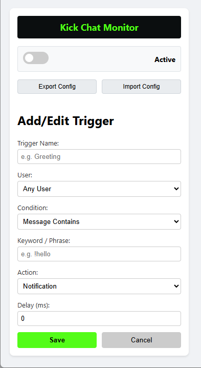

# 🎮 Kick.com Chat Monitor

A Chrome/Brave extension that monitors Kick.com chat and triggers automated actions based on keywords.



## ✨ Features

- **🔍 Chat Monitoring** - Automatically detects new messages in Kick.com chat
- **⚡ Trigger Actions** - Execute actions when keywords are detected:
  - 🔔 Desktop notifications
  - 🔊 Sound alerts
  - 💬 Auto-reply messages
- **👤 User Filtering** - Target specific users or any user
- **🎯 Match Conditions** - "Contains" or "Exact match"
- **⏱️ Delay Support** - Add delay before action execution
- **📁 Import/Export** - Save and load configurations as JSON
- **🔘 Global Toggle** - Enable/disable monitoring with one click

## 📸 Screenshots

### Extension Popup


### Adding a Trigger


## 🚀 Installation

### From Chrome Web Store
1. Visit [Chrome Web Store](#) (link coming soon)
2. Click "Add to Chrome"
3. Confirm installation

### Manual Installation (Developer Mode)
1. Download or clone this repository
2. Open `chrome://extensions/` in Chrome/Brave
3. Enable **Developer mode** (top right)
4. Click **Load unpacked**
5. Select the `kick-bot-chrome-addon` folder

## ⚙️ Configuration

### Adding a Trigger

1. Click the extension icon in toolbar
2. Click **"Add New Trigger"**
3. Fill in the fields:

| Field | Description |
|-------|-------------|
| **Trigger Name** | Friendly name for the trigger |
| **User** | "Any User" or "Specific User" (enter username) |
| **Condition** | "Message Contains" or "Exact Match" |
| **Keyword** | Text to watch for (e.g., `!hello`) |
| **Action** | Notification, Sound, or Send Chat Message |
| **Delay** | Milliseconds to wait before executing action |

4. Click **Save**

### Import/Export Configuration

- **Export**: Click "Export Config" to download your triggers as JSON
- **Import**: Click "Import Config" to load triggers from a JSON file

#### Example Configuration (config.json)
```json
{
    "triggers": [
        {
            "name": "Welcome Message",
            "userType": "any",
            "username": "",
            "condition": "contains",
            "keyword": "!hello",
            "action": "sendMessage",
            "actionValue": "Welcome to the stream!",
            "delay": 0
        }
    ]
}
```

## 🔒 Privacy

This extension:
- ✅ Stores all data locally on your device
- ✅ Does NOT collect personal information
- ✅ Does NOT send data to external servers
- ✅ Does NOT track your browsing

See [PRIVACY.md](PRIVACY.md) for full privacy policy.

## 🛠️ Technical Details

### Permissions

| Permission | Reason |
|------------|--------|
| `storage` | Save trigger configurations |
| `notifications` | Show desktop alerts |
| `scripting` | Inject chat monitor script |
| `kick.com/*` | Access Kick.com chat |

### File Structure

```
kick-bot-chrome-addon/
├── manifest.json          # Extension manifest (V3)
├── PRIVACY.md             # Privacy policy
├── README.md              # This file
├── icons/
│   ├── icon16.png
│   ├── icon48.png
│   └── icon128.png
├── src/
│   ├── background.js      # Service worker for notifications
│   ├── content.js         # Chat monitoring script
│   └── popup/
│       ├── popup.html     # Popup UI
│       ├── popup.css      # Popup styles
│       └── popup.js       # Popup logic
└── docs/
    └── *.png              # Screenshots
```

## 📝 Changelog

### v1.0.0
- Initial release
- Chat monitoring with MutationObserver
- Trigger system with conditions
- Notification, sound, and chat actions
- Import/Export configuration
- Global enable/disable toggle

## 🤝 Contributing

Contributions are welcome! Please open an issue or pull request.

## 📄 License

MIT License - see [LICENSE](LICENSE) for details.

---

Made with ❤️ for the Kick.com community
